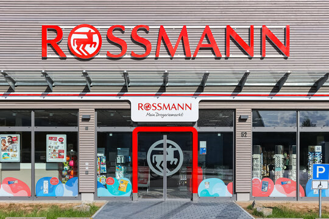
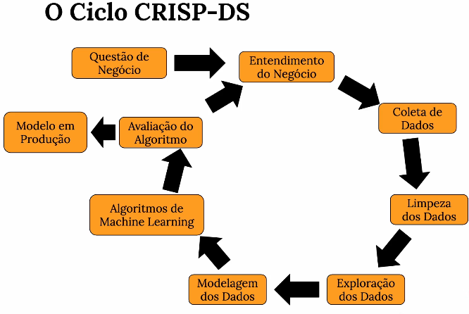
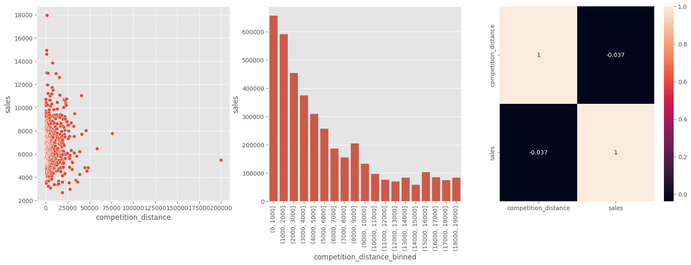
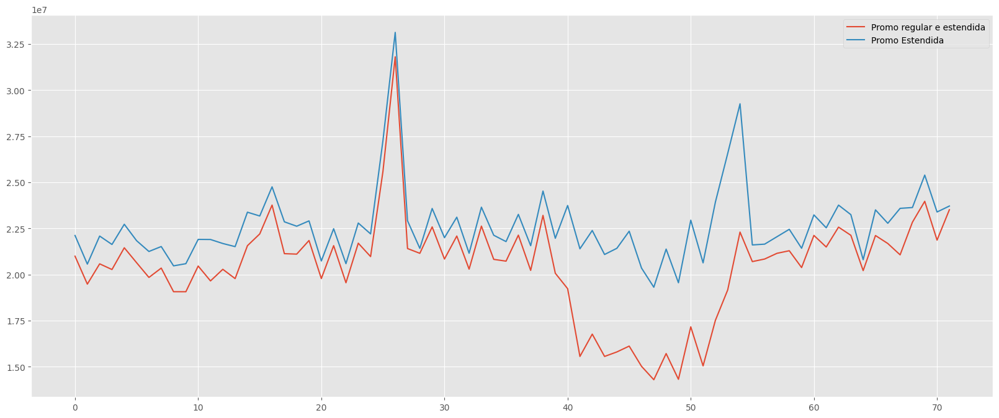
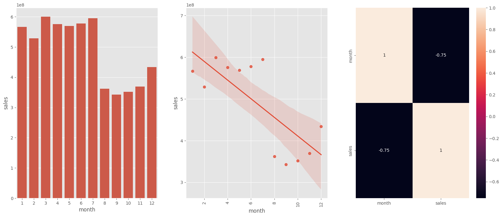
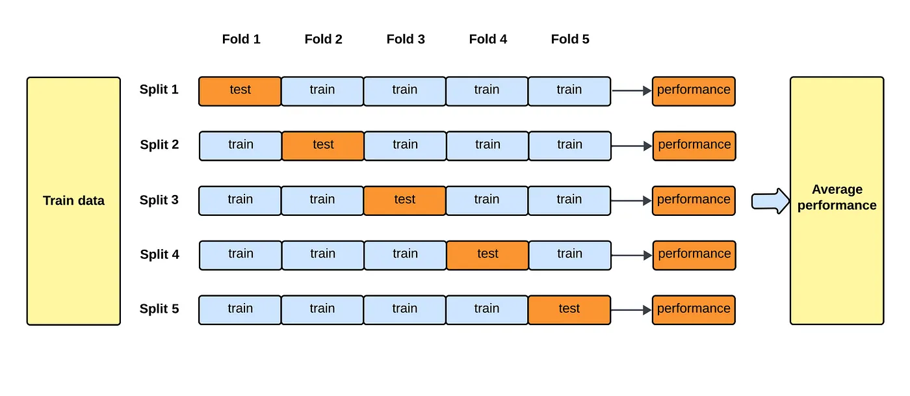

# Rossmann Sales Forecast

Rossmann é uma das maiores redes de drogarias da Europa, com cerca de 56.200 funcionários e mais de 4.000 lojas

# 💼 Contexto de negócio
A Rossmann é uma das maiores redes de drogarias da Europa. Nesse contexto de negócio, O CFO da empresa solicitou uma previsão das vendas das lojas para as próximas 6 semanas, o problema que o CFO está enfrentando é que atualmente as previsões de vendas são feitas pelos próprios gerentes de loja, o que resulta em divergências e dados inconfiáveis. Por isso o CFO quer ter uma noção clara e assertiva do orçamento disponível para planejar as reformas das lojas da Rossmann. O CFO também é uma pessoa muito ocupada e costuma viajar a trabalho e precisa que a solução esteja disponível no seu celular para que ele possa acessar de qualquer lugar com acesso à internet.

Após entender a questão de negócio, conclui que a solução do CFO realmente é a mais adequada para o problema, portanto, meu objetivo é prever as vendas das lojas para as próximas 6 semanas. Isso pode ser importante para que os stakeholders possam saber quanto de orçamento eles terão disponível para fazer reformas nas lojas, o que deve aumentar a produtividade, planejamento e economia da empresa.

# 📋 Qual o meu plano para resolver o problema?
Meu planejamento é aplicar o método cíclico CROSS-INDUSTRY PROCESS-DATA SCIENCE (CRISP-DS) que tem o objetivo de terminar o primeiro ciclo end-to-end de maneira rápida com os dados disponíveis para mapear todos os problemas que podem estar em diferentes etapas do projeto e entregar valor rápido para os stakeholders.

# 🎯 Como pretendo entregar isso funcionando?
Pretendo entregar um bot no telegram, disponível em mãos a qualquer momento onde o CFO possa interagir com o bot e receber em tempo real o valor da previsão da respectiva loja.

# 📖 Dicionário dos Dados
| Coluna                | Descrição                                                                                                                                  |
|-----------------------|--------------------------------------------------------------------------------------------------------------------------------------------|
| Id                    | um Id que representa um (Store, Date) duplo dentro do conjunto de teste                                                                    |
| Store                  | um ID exclusivo para cada loja                                                                                                             |
| Sales                | o volume de negócios de um determinado dia (é isso que estou prevendo)                                                                 |
| Customers              | o número de clientes em um determinado dia                                                                                                |
| Open                | um indicador para saber se a loja estava aberta: 0 = fechada, 1 = aberta                                                                   |
| StateHoliday          | indica um feriado estadual. Normalmente, todas as lojas, com poucas exceções, fecham em feriados estaduais. a = feriado, b = Páscoa, c = Natal, 0 = Nenhum |
| SchoolHoliday         | indica se a (Loja, Data) foi afetada pelo fechamento de escolas públicas                                                                   |
| StoreType             | diferencia entre 4 modelos de loja diferentes: a, b, c, d                                                                                  |
| Assortment            | descreve um nível de sortimento: a = básico, b = extra, c = estendido                                                                      |
| CompetitionDistance   | distância em metros até a loja concorrente mais próxima                                                                                    |
| CompetitionOpenSince[Month/Year]  |  fornece o ano e o mês aproximados da abertura do concorrente mais próximo                                                     |
| Promo              | indica se uma loja está realizando uma promoção naquele dia                                                                                |
| Promo2                | Promo2 é uma promoção contínua e consecutiva para algumas lojas: 0 = loja não está participando, 1 = loja está participando                 |
| Promo2Since[Year/Week]           | descreve o ano e a semana do calendário em que a loja começou a participar do Promo2                                          |
| PromoInterval         | descreve os intervalos consecutivos em que o Promo2 é iniciado, nomeando os meses em que a promoção é iniciada novamente. Por exemplo, "fev, mai, ago, nov" significa que cada rodada começa em fevereiro, maio, agosto, novembro de qualquer ano para aquela loja |

# 🛠️ Ferramentas Utilizadas

## Análise de Dados
- **Python 3.9.19:** Linguagem de programação utilizada para desenvolvimento de scripts e análise de dados.
- **Estatística Descritiva:** Método utilizado para resumir e interpretar os dados.
- **Exploratory Data Analysis (EDA):** Processo de investigação inicial dos dados para descobrir padrões, entender melhor o negócio e testar hipóteses.

## Modelagem de Dados e treinamento de algoritmos
- **Scikit-learn:** Biblioteca de machine learning em Python usada para pré processamento de dados e implementação de algoritmos de aprendizado supervisionado e não supervisionado.
- **Boruta:** Ferramenta utilizada para seleção de features, ajudando a identificar as variáveis mais importantes para modelos preditivos.
- **XGBoost Regressor:** Implementação avançada do algoritmo Gradient Boosting, otimizada para problemas de regressão, conhecida pela alta precisão e eficiência.
- **Random Search:** Técnica usada para otimizar hiperparâmetros em modelos de machine learning através da geração aleatória de combinações.

## Desenvolvimento e controle de versão
- **Git:** Sistema de controle de versão amplamente utilizado para gerenciar o código-fonte.
- **Anaconda:** Programa de gerenciamento de ambientes virtuais no Windows, facilitando a gestão de pacotes e dependências.

## API e integração com Bot no telegram
**Flask:** Framework web em Python utilizado para criação de APIs e aplicações web
**Telegram bot:** Integração de bot no Telegram para interação com usuários através de mensagens.

## Deploy do modelo e do Bot
**Render:** Plataforma que oferece serviços para criação de web services e aplicações web

# 💡 Top 3 Insights
## Competidores Próximos Aumentam as Vendas

## Lojas com mais promoções consecutivas vendem menos

## Lojas vendem menos no segundo semestre do ano

# 🤖 Machine Learning Modelling
## Cross Validation
Para achar a performance real dos modelos, utilizei a estratégia de Cross Validation respeitando a ordem cronológica dos dados.

## 5 melhores modelos
Implementei os 5 melhores modelos, começando pelos mais simples para verificar se os dados são lineares e indo até os mais complexos para explorar a capacidade de ajuste aos dados.

- Average Model
- Linear Regression
- Linear Regression Lasso
- Random Forest Regressor
- XGBoost Regressor

| Model Name              | MAE CV               | MAPE CV              | RMSE CV              |
|-------------------------|----------------------|----------------------|----------------------|
| Random Forest Regressor | 696.29+/-0.0         | 0.1+/-0.0            | 1003.2+/-0.0         |
⁠| Average Model             1354.800353⁠⁠            0.2064                 1835.135542
| XGBoost Regressor       | 1858.17+/-290.66     | 0.25+/-0.01          | 2686.29+/-432.14    |
| Linear Regression       | 2081.73+/-295.63     | 0.3+/-0.02           | 2952.52+/-468.37    |
| Lasso                   | 2116.38+/-341.5      | 0.29+/-0.01          | 3057.75+/-504.26    |

## Modelo Final
O modeo XGBoost apresentou a segunda melhor performance, mas decidi continuar com ele devido ao seu custo computacional e de armazenamento menor.

| Model Name          | MAE        | MAPE     | RMSE       |
|---------------------|------------|----------|------------|
| XGBoost Regressor   | 711.261772 | 0.104962 | 1040.146127|

# 💲 Business Performance
Essa foi a soma total das previsões de todas as lojas com um erro médio de aproximadamente 10% por loja, esse erro pode ser tanto para cima quanto para baixo como mostrado na tabela.  

| Scenario        | Values             |
|-----------------|--------------------|
| predictions     | R$284,830,304.00   |
| worst_scenario  | R$284,033,963.60   |
| best_scenario   | R$285,626,620.68   |

# 📲 Produto final
O produto final do projeto é a integração de um bot no Telegram para interação com usuários através de mensagens. Assim o CFO e outros stakeholders podem ter acesso às previsões do modelo na palma da mão em qualquer lugar com acesso à internet.

# 🎯 Conclusão 
Meu modelo cumpre o objetivo de fornecer previsões de vendas das lojas da Rossmann para as próximas 6 semanas, de forma acessível, em qualquer dispositivo iOS ou Android. Basta enviar o código da loja e o bot retornará a previsão de vendas correspondente. Isso permite que os stakeholders tomem decisões de negócio em qualquer lugar que estejam.

Agora os gerentes das lojas não precisam fazer previsões manuais pois o modelo faz previsões de vendas mais consistentes.

Outro ponto importante foram os insights que descobri na Análise exploratória de Dados. 
- Competidores próximos aumentam as vendas das lojas
- Lojas com mais promoções consecutivas vendem menos
- Lojas vendem menos no segundo semestre do ano

# 🎯 Próximos Passos
No segundo ciclo do CRISP-DS buscarei implementar as seguintes melhorias
- **Testar outros modelos de Machine learning:** Explorar diferentes algoritmos e identificar se algum deles oferece uma performance melhor.
- **Testar novos métodos de hyperparameter fine-tunning:** Experimentar novas técnicas de ajuste de hiperparâmetros como Baesyan Optimization.
- **Investigar erros nas lojas 292 e 909:** Analisar as razões pelas quais essas lojas apresentam erros acima de 50% e encontrar soluções.
- **Implementar o pipeline do scikit-learn:** Automatizar o fluxo de trabalho de modelagem para tornar o processo mais eficiente.
- **Melhorar o tratamento de data leakage:** Identificar e corrigir possíveis vazamentos de dados. 

